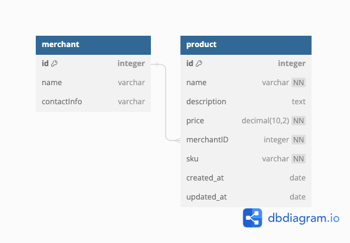

# Shop Anything Lagos API Documentation

This API provides basic CRUD (Create, Read, Update, Delete) operations for managing merchants products.

## Base URL
http://localhost:8080


## Endpoints

| Endpoint          | Method | Description                        | Request Body                                 | Success Response                              | Error Response                  |
|-------------------|--------|------------------------------------|----------------------------------------------|-----------------------------------------------|---------------------------------|
| `/api/products/{merchantID}`          | POST   | Create a new product.            | ```json {"sku":"sku1","name":"name1","description":"description1","price":20.54} ```  | **201 Created** <br> ```json {"sku":"sku1","name":"name1","description":"description1","price":20.54,"created_at":"2024-02-20T23:51:20.964278+01:00","updated_at":"2024-02-20T23:51:20.964279+01:00"} ``` | **400 Bad Request**            |
| `/api/products/{merchantID}`          | GET    | Get a list of all merchant products.     | -                                            | **200 OK** <br> ```json [ { "id": "Ml1f5yF74FW66jKC", "merchant_id": "1", "sku": "sku1", "name": "name1", "description": "description1", "price": 20.54, "created_at": "2024-02-20T23:51:20.964278+01:00", "updated_at": "2024-02-20T23:51:20.964279+01:00" } ] ``` | -                               |
| `/api/products/{merchantID}/{skuID}`     | GET    | Get a single merchant product.        | -                                            | **200 OK** <br> ```json { "id": "Ml1f5yF74FW66jKC", "merchant_id": "1", "sku": "sku1", "name": "name1", "description": "description1", "price": 20.54, "created_at": "2024-02-20T23:51:20.964278+01:00", "updated_at": "2024-02-20T23:51:20.964279+01:00" } ``` | **404 Not Found**              |
| `/api/products/{merchantID}/{skuID}`     | PUT    | Update a single merchant product.     | ```json {"name":"name2","description":"description2","price":50} ```  | **200 OK** <br> ```json {"sku":"sku1","name":"name1","description":"description1","price":20.54,"created_at":"2024-02-20T23:51:20.964278+01:00","updated_at":"2024-02-20T23:51:20.964279+01:00"} ``` | **400 Bad Request** <br> **404 Not Found** |
| `/api/products/{merchantID}/{skuID}`     | DELETE | Delete a single merchant product.     | -                                            | **204 No Content**                            | **404 Not Found**              |

## ERD DESIGN


## Question 2b
How can you design the database for this particular problem for performance given that you have a large number of merchants?
It can be designed for performance by partitioning large tables into smaller segments which aids in managing data and enhances query performance by working on smaller subsets. 
Also, you can optimize SQL queries which minimizes resource consumption, utilizing appropriate join types and WHERE clauses. 
Caching frequently accessed data in memory reduces disk fetches, leading to faster response times. 
These practices collectively optimize database performance, balancing data integrity with efficient query execution.
Indexing frequently queried columns improves search speed, but excessive indexing can slow down write operations. 

## Question 2c
What would inform your choice of a database when solving this particular problem?
high scalability and performance: SQL databases can handle large amounts of data and high concurrent user requests.
data integrity and consistency: SQL databases offer built-in features for data integrity, such as constraints, triggers, and transactions, which help maintain data consistency and reliability.
complex and structured data:  SQL databases are designed to handle structured data with well-defined schemas, such as financial transactions, user profiles, or product information


